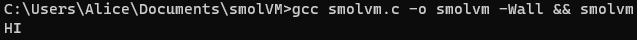
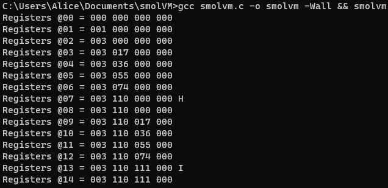

# smolVM
a smol 8-bit virtual register machine

Current status:
- 4 8-bit registers represented in octal
- 3 Opcodes: Exit 0, Add 1, Print 2
- Reads in-memory program from `program` array
- Debug mode to print register per cycle

Goals:
- Make operands more than one hex digit wide, up to 1-byte.
- Make programs be able to come from a file.
- Add flag parsing to toggle debug mode.
- More opcodes starting with: `mov`, `sub`, `and`, `or`.

Program 1:  
  
Program 1 Debug:   
  
