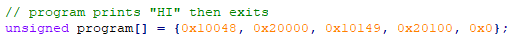

# smolVM
a smol 8-bit virtual register machine

## Project Status:
- 4 8-bit registers represented in octal
- 3 Opcodes: Exit 0, Add 1, Print 2
- Reads in-memory program from `program` array
- Debug mode to print register per cycle

## Goals:
- Make operands more than one hex digit wide, up to 1-byte.
- Make programs be able to come from a file.
- Add flag parsing to toggle debug mode.
- More opcodes starting with: `mov`, `sub`, `and`, `or`.

## MVP Screenshots

Program 1:   
  
Program 1 run:  
  
Program 1 Debug:   
  

### Research:
- https://en.wikipedia.org/wiki/8-bit_computing
- https://en.wikipedia.org/wiki/Intel_8008
- https://eater.net/8bit/

- https://en.wikipedia.org/wiki/Little_Computer_3
- https://www.jmeiners.com/lc3-vm/

- https://craftinginterpreters.com/a-virtual-machine.html

- https://chapmanworld.com/lets-write-a-virtual-machine/
- https://www.andreinc.net/2021/12/01/writing-a-simple-vm-in-less-than-125-lines-of-c
- https://en.wikibooks.org/wiki/Creating_a_Virtual_Machine/Register_VM_in_C

- https://en.wikipedia.org/wiki/Kenbak-1
