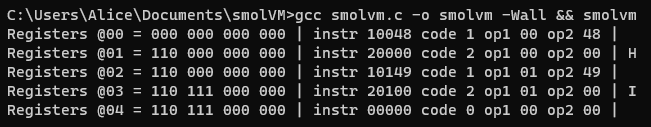

# smolVM
a smol (small) virtual machine

Current status:  
- 4 1-byte registers
- 3 Opcodes: Exit, Add, Print
- Reads in-memory program
- Debug mode to print register per cycle

Program 1:  
  
Program 1 Debug:   
  
